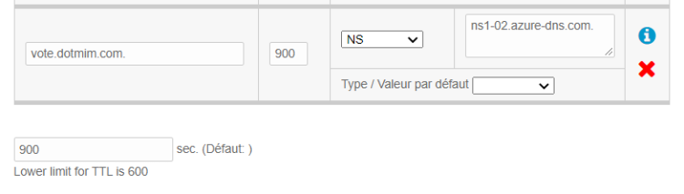

# Using DNS solver within an Azure Kubernetes Services cluster, using CertManager and Let's Encrypt to secure the cluster and be able to close port 80

## TL;DR;

This repository explains how to implements the **DNS01** challenge within **AKS** using **cert-manager**, **Let's Encrypt** and **Azure DNS Zone**.

This assumes that:
- You own a domain name.
- You are able to create an NS record from within your domain provider to be able to redirect all that sub domain queries to Azure DNS Zone.


## Intoduction

The most common way to secure an [AKS](https://azure.microsoft.com/en-us/services/kubernetes-service/) cluster is to use *https* endpoint from within your reverse proxy (like nging or traefik)

A usefull pattern is to use the combo [Let's Encrypt](https://letsencrypt.org/) and [Cert manager](https://cert-manager.io/docs/) to get a real certificate from **Let's encrypt**, that will be renewed over time.

**Let's Encrypt** uses the **ACME** protocol to verify that you control a given domain name and to issue you a certificate.

## Solving challenges

In order for the **ACME CA** server to verify that a client owns the domain, or domains, a certificate is being requested for, the client must complete **challenges**.

We have mainly 2 types of challenges available:
- **HTTP01** challenge is completed by presented a computed key on a regular **HTTP** url endpoint.
- **DNS01** challenge is completed by presented a computed key that is present in a **DNS TXT** record.

## HTTP01 problem

In some circumstances, you just want your cluster to be available using **only** a secure connection over **https**.   
The main issue with the **HTTP01** solving challenge is that you have to let an url endpoint opened on port 80.  
**IF** you are considering this as a security issue, you may want to resolve your challenge, using the **DNS01** challenge.

## Using DNS01 challenge

This respository explains how to implement a **DNS01** challenge in an **Azure** environnement, using:
- **AKS** as a kubernetes cluster
- **NGINX** as ingress
- **Cert Manager** as a certificate management controller
- **DNS Zone** as a dns resolution engine

Obviously we will use some useful (and almost mandatory is you are working with kubernetes) tools like **kubectl** and **helm**

The sample application used is the [Azure voting application sample](https://github.com/Azure-Samples/azure-voting-app-redis) that will be slightly modified to add an **nginx** controller as an ingress.

## DNS zone

In this example, I'm working with my own domain called **dotmim.com** (I used to have a blog on this domain.. long time ago !)

I will create a sub domain that will redirect all the trafic for this sub domain to my DNS Zone.

First of all, you may want to create your **Azure DNS zone**.  
Keep in mind that your dns zone should be a sub domain of your domain.

In the screenshot below, we will manage a subdomain called **vote.dotmim.com**:


Once created, just copy the **Name server 1** property (in my case *ns1-02.azure-dns.com.*)

From my domain provider, i'm registering a new **NS** entry that will redirect everything to my **DNS Zone**:



You can check that the redirection is working by doing a quick `ns lookup`:

``` sh
nslookup -type=SOA dotmim.com
Non-authoritative answer:
dotmim.com
        origin = ns1.amen.fr


nslookup -type=SOA vote.dotmim.com
Non-authoritative answer:
vote.dotmim.com
        origin = ns1-02.azure-dns.com
```

*(Some informations have been removed for clarity)*

As you can see the root domain is handled by my domain provider and the *vote.\** sub domain is now handled by my new created Azure DNS Zone.

### nginx load balancer

The application we want to deploy is quite simple and based on the [Azure voting application sample](https://github.com/Azure-Samples/azure-voting-app-redis).

You will find the deployment script here : [./vote.yaml](vote.yaml)

The only modification is that we will use an nginx ingress as entry point instead of exposing the vote application directly.

Adding nginx is quite straightforward using the official helm chart:

``` sh
# Create a namespace for your ingress resources
kubectl create namespace ingress-basic

# Use Helm to deploy an NGINX ingress controller
helm install nginx stable/nginx-ingress \
    --namespace ingress-basic \
    --set controller.replicaCount=2 \
    --set controller.nodeSelector."beta\.kubernetes\.io/os"=linux \
    --set defaultBackend.nodeSelector."beta\.kubernetes\.io/os"=linux
```

### cert-manager

to be able to manage everything, we are installing as well **cert-manager** on the cluster:

``` sh
# Deploy custom resources definition
kubectl apply --validate=false -f https://github.com/jetstack/cert-manager/releases/download/v0.14.1/cert-manager.crds.yaml

# create namespace for cert
kubectl create namespace cert-manager  

# Add repo
helm repo add jetstack https://charts.jetstack.io
helm repo update

# Label the ingress-basic namespace to disable resource validation
kubectl label namespace ingress-basic cert-manager.io/disable-validation=true

# Install cert manager
helm install cert-manager jetstack/cert-manager \
     --namespace cert-manager \
     --version v0.14.1 \
     --set ingressShim.defaultIssuerName=letsencrypt-staging \
     --set ingressShim.defaultIssuerKind=ClusterIssuer
```

### Service principal

Once it's done, we need a **service principal** to be able to reach the DNS Zone from within our cluster. 

For the sake of simplicity, I will create a simple service principal without any role assignement, but you may want to look at the **cert-manager** official documentation to ensure you have the least privileges assigned to your spn : [Azure DNS configuration](https://cert-manager.io/docs/configuration/acme/dns01/azuredns/)

Once created, we will save it as a **secret** in the AKS cluster.

``` sh
# Create a service principal for DNS validation
$ az ad sp create-for-rbac --name spcertmanageridentity

Creating a role assignment under the scope of "/subscriptions/subid000-eeee-ffff-gggg-hhhhhhhhhhhh"
{
  "appId": "appid000-aaaa-bbbb-cccc-dddddddddddd",
  "displayName": "spcertmanageridentity",
  "name": "http://spcertmanageridentity",
  "password": "password-aaaa-bbbb-cccc-dddddddddddd",
  "tenant": "tenant00-aaaa-bbbb-cccc-dddddddddddd"
}

kubectl create secret generic azuredns-config --from-literal=client-secret=password-aaaa-bbbb-cccc-dddddddddddd -n cert-manager

```

### DNS Issuer

This is where everything is happening.   
Your DNS issuer is the configuration that will be used by cert manager to be abel to create the TXT record asked by the ACME CA (Let's Encrypt)

Here is a DNS issuer used with the Let's Encrypt staging endpoint:

``` yaml
apiVersion: cert-manager.io/v1alpha2
kind: ClusterIssuer
metadata:
  name: letsencrypt-staging
spec:
  acme:
    server: https://acme-staging-v02.api.letsencrypt.org/directory
    email: yourname@youremail.com
    # Name of a secret used to store the ACME account private key
    privateKeySecretRef:
      name: letsencrypt
    # ACME DNS-01 provider configurations
    solvers:
    - dns01:
        azuredns:
          clientID: appid000-aaaa-bbbb-cccc-dddddddddddd
          clientSecretSecretRef:
            name: azuredns-config
            key: client-secret
          subscriptionID: subid000-eeee-ffff-gggg-hhhhhhhhhhhh
          tenantID: tenant00-aaaa-bbbb-cccc-dddddddddddd
          resourceGroupName: rgdns
          hostedZoneName: vote.dotmim.com
          environment: AzurePublicCloud
```

> Do not hesitate to create all the cluster issuer you need: DNS with Let's Encrypt staging / DNS with Let's Encrypt production and so on...
> You will use the one you need from the ingress configuration object.

``` sh
kubectl apply -f dnsissuer.yaml
```

### ingress

Now that we've deployed everything we need, just create an ingress with the correct values:

``` yaml
apiVersion: extensions/v1beta1
kind: Ingress
metadata:
  annotations:
    kubernetes.io/ingress.class: nginx
    ingress.kubernetes.io/ssl-redirect: "false"
    ingress.kubernetes.io/force-ssl-redirect: "false" 
    #nginx.ingress.kubernetes.io/rewrite-target: /
    cert-manager.io/cluster-issuer: letsencrypt-staging
  name: vote-ingress
spec:
  tls:
    - hosts:
        - vote.dotmim.com
      secretName: tls-secret
  rules:
    - host: vote.dotmim.com
      http:
        paths:
          - backend:
              serviceName: azure-vote-front
              servicePort: 80
```


